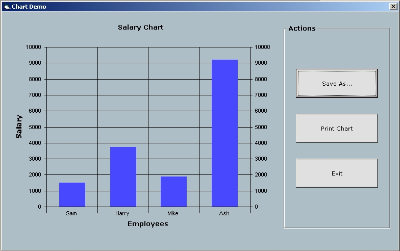



## MSChart Control \- Printing and Saving

### Description

Hello Everyone, I'm Uploading this Project for the ones who need Help regarding VB's MSCHART CONTROL!!!

This Sample Shows :

1) How to Show Data from an Access2003 Database on Chart.

2) How to Print Data from MSChart Control.

3) How to "Save As..." the Chart, as .Bmp file.

Hope this will be helpful!!!

and don't forget to Vote.

Regards
 
### More Info
 

             |
---                |---
**Submitted On**   |2007-08-18 00:14:08
**By**             |[Orion\-Solutions](https://github.com/Planet-Source-Code/PSCIndex/blob/master/ByAuthor/orion-solutions.md)
**Level**          |Intermediate
**User Rating**    |4.5 (36 globes from 8 users)
**Compatibility**  |VB 5\.0, VB 6\.0
**Category**       |[OLE/ COM/ DCOM/ Active\-X](https://github.com/Planet-Source-Code/PSCIndex/blob/master/ByCategory/ole-com-dcom-active-x__1-29.md)
**World**          |[Visual Basic](https://github.com/Planet-Source-Code/PSCIndex/blob/master/ByWorld/visual-basic.md)
**Archive File**   |[MSChart\_Co2079898182007\.zip](https://github.com/Planet-Source-Code/orion-solutions-mschart-control-printing-and-saving__1-69174/archive/master.zip)

